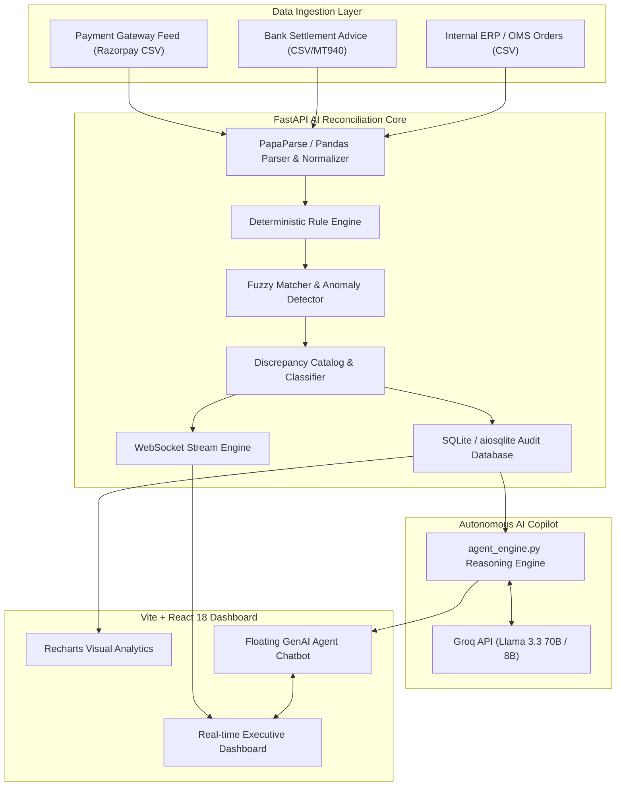

# ⚡ Razorpay AI Reconciliation Engine & Autonomous GenAI Agent

[](https://razorpay.com)
[](https://fastapi.tiangolo.com)
[](https://reactjs.org)
[](https://vitejs.dev)
[](https://tailwindcss.com)
[](https://groq.com)
[](https://python.org)

> An enterprise-grade, high-throughput **AI Reconciliation Engine** with an **Autonomous GenAI Financial Copilot** designed to automatically ingest, match, audit, and resolve multi-way discrepancies between Payment Gateway (PG) transactions, Bank settlements, and Internal ERP/OMS records in seconds.

---

## 📌 Table of Contents
- [Problem Statement](#-problem-statement)
- [Key Features](#-key-features)
- [System Architecture](#-system-architecture)
- [Tech Stack](#-tech-stack)
- [Repository Structure](#-repository-structure)
- [Installation & Quickstart](#-installation--quickstart)
  - [1. Backend Setup](#1-backend-setup-fastapi)
  - [2. Frontend Setup](#2-frontend-setup-react--vite)
- [API Reference](#-api-reference)
- [GenAI Autonomous Copilot](#-genai-autonomous-copilot)
- [Reconciliation Rules & Discrepancy Taxonomy](#-reconciliation-rules--discrepancy-taxonomy)
- [Environment Configuration](#-environment-configuration)
- [License & Credits](#-license--credits)

---

## 🎯 Problem Statement

High-volume merchants and financial institutions face immense challenges in **financial reconciliation**:
- **Multi-way Data Inconsistencies**: Gateway settlement summaries, bank credit logs, and merchant order management systems (OMS/ERP) often disagree on amounts, fees, and timestamps.
- **Hidden MDR / Fee Leakage**: Merchants unknowingly pay incorrect Merchant Discount Rate (MDR), GST, or platform fees on edge cases (chargebacks, partial refunds, international cards).
- **Manual Dispute Resolution**: Financial teams spend hundreds of manual hours every week sifting through Excel sheets to investigate unmatched transactions and chargeback claims.
- **Latency in Settlement Visibility**: Delays between capture and settlement lead to working capital uncertainty.

**Razorpay AI Reconciliation Engine** solves this by automating multi-way matching with deterministic rules, fuzzy matching, anomaly detection, and an AI-driven autonomous financial analyst.

---

## ✨ Key Features

### 🔍 1. Multi-Way Deterministic & Fuzzy Matching
- Performs 3-way matching across **Payment Gateway**, **Bank Statements**, and **Internal Orders**.
- High-performance vector matching using `thefuzz` and `pandas` for handling timestamp drifts, micro-variances, and fuzzy reference IDs.

### 🛡️ 2. Deep Discrepancy Taxonomy & Root Cause Analysis
- Automatically categorizes exceptions:
  - **MDR Fee Overcharge**: Detected fee deductions higher than agreed contractual rates.
  - **Missing Payout / Bank Drop**: Captured by PG but missing from bank credits.
  - **Timing & Settlement Delays**: Payments captured on day $T$ but settled after $T+2$.
  - **Status Mismatches**: Captured vs Failed vs Refunded states out of sync across systems.
  - **Duplicate Debits / Credits**: Double-counted webhooks or duplicate bank entries.

### 🤖 3. Autonomous GenAI Financial Copilot
- Powered by **Groq Llama-3.3-70B** for ultra-fast, low-latency conversational reasoning.
- Explains root causes of discrepancies in plain English/Hindi.
- Suggests actionable next steps: raises dispute tickets, drafts merchant/bank query emails, and provides settlement advice.
- Interactive quick prompts: *"Analyze all fee overcharges"*, *"Show high-value unmatched transactions"*, *"Draft bank dispute email"*.

### 📊 4. Executive Real-Time Dashboard
- Live reconciliation progress powered by **WebSockets**.
- Visualized KPIs: **Total Volume**, **Reconciliation Rate (%)**, **Settlement Variance (₹)**, and **Identified Leakage**.
- Interactive charts built with **Recharts**:
  - Matched vs Mismatched transaction distribution
  - Discrepancy breakdown by category
  - Settlement timeline variance trends
- One-click file upload (drag-and-drop CSV parser) and full audit report exports.

---

## 🏗️ System Architecture



---

## 🛠️ Tech Stack

| Layer | Technology | Description |
|---|---|---|
| **Frontend** | **React 18** + **Vite 6** | Modern, fast reactive single-page dashboard |
| **Styling** | **Tailwind CSS** + **Lucide Icons** | Glassmorphism, dark/light theme, modern fin-tech UI |
| **Data Viz** | **Recharts** | Interactive bar, pie, and timeline trend charts |
| **Backend API** | **FastAPI** (Python 3.10+) | High-throughput asynchronous REST + WebSockets API |
| **Data Processing**| **Pandas**, **NumPy**, **TheFuzz** | In-memory dataset joins, fuzzy logic, and math modeling |
| **Database** | **SQLAlchemy** + **aiosqlite** | Async transactional storage for audit trails & records |
| **AI / LLM** | **Groq SDK** (`llama-3.3-70b-versatile`) | Ultra-fast token generation for financial agent reasoning |
| **Payment SDK** | **Razorpay Python SDK** | Ready for live webhook and payment link integration |

---

## 📂 Repository Structure

```
razorpay-buildathon/
│
├── README.md                           # Master Project Documentation
├── .gitignore                          # Root Git ignore rules
│
├── razorpay-recon-backend/             # FastAPI Backend Service
│   ├── main.py                         # FastAPI routes, WebSocket endpoints & app lifecycles
│   ├── engine.py                       # Core 3-way matching & fuzzy reconciliation algorithms
│   ├── agent_engine.py                 # Autonomous GenAI Copilot (Groq integration)
│   ├── catalog.py                      # Discrepancy taxonomy, error codes & rule definitions
│   ├── models.py                       # Pydantic schemas & SQLite database models
│   ├── requirements.txt                # Python dependencies
│   ├── .env.example                    # Environment variable template
│   └── .gitignore                      # Backend-specific ignore rules
│
└── razorpay-recon-frontend/            # React + Vite Frontend Service
    ├── package.json                    # Node dependencies & npm scripts
    ├── vite.config.js                  # Vite configuration
    ├── tailwind.config.js              # Tailwind custom styling theme
    ├── index.html                      # App entry point
    └── src/
        ├── App.jsx                     # Core Dashboard, Metrics & File Ingestion UI
        ├── main.jsx                    # React root renderer
        ├── index.css                   # Global styles & Tailwind directives
        └── components/
            └── AgentChatbot.jsx        # Floating GenAI Copilot Chatbot Widget
```

---

## 🚀 Installation & Quickstart

### Prerequisites
- **Node.js** (v18.0.0 or higher) & **npm**
- **Python** (v3.10 or higher)
- **Groq API Key** (Get free at [console.groq.com](https://console.groq.com))

---

### 1. Backend Setup (FastAPI)

1. Open your terminal and navigate to the backend folder:
   ```bash
   cd razorpay-recon-backend
   ```

2. Create and activate a Python virtual environment:
   ```bash
   # Windows (PowerShell)
   python -m venv venv
   .\venv\Scripts\Activate.ps1

   # macOS / Linux
   python3 -m venv venv
   source venv/bin/activate
   ```

3. Install required Python packages:
   ```bash
   pip install -r requirements.txt
   ```

4. Configure your environment variables:
   Create a `.env` file inside `razorpay-recon-backend/`:
   ```bash
   cp .env.example .env
   ```
   Add your Groq API key in `.env`:
   ```env
   GROQ_API_KEY=gsk_your_groq_api_key_here
   ```

5. Start the FastAPI backend server:
   ```bash
   uvicorn main:app --reload --port 8000
   ```
   Backend will run at: **`http://localhost:8000`**  
   Interactive Swagger docs: **`http://localhost:8000/docs`**

---

### 2. Frontend Setup (React + Vite)

1. Open a second terminal window and navigate to the frontend folder:
   ```bash
   cd razorpay-recon-frontend
   ```

2. Install npm dependencies:
   ```bash
   npm install
   ```

3. Start the Vite development server:
   ```bash
   npm run dev
   ```
   Frontend will run at: **`http://localhost:5173`** (or configured port).

---

## 🔌 API Reference

| Method | Endpoint | Description |
|---|---|---|
| `GET` | `/` | Health check & engine status |
| `POST` | `/upload` | Upload multi-source CSV files (PG, Bank, OMS) |
| `POST` | `/process/{batch_id}` | Initiate deterministic & fuzzy reconciliation engine |
| `GET` | `/results/{batch_id}` | Retrieve comprehensive match analytics and discrepancy lists |
| `POST` | `/chat` | Chat with the GenAI Autonomous Financial Copilot |
| `GET` | `/catalog/ai-readable` | Fetch machine-readable discrepancy taxonomy rules |
| `WS` | `/ws` | Real-time WebSocket stream for reconciliation progress & events |

---

## 🧠 GenAI Autonomous Copilot

The embedded **AI Recon Copilot** (`agent_engine.py`) acts as an intelligent financial auditor. When queried, it inspects current batch metrics, pinpoints underlying discrepancies, and suggests remedies.

### Sample Prompts:
- 💬 *"Analyze why our bank settlement variance is high today."*
- 💬 *"Which transactions suffered an MDR fee overcharge?"*
- 💬 *"Draft a dispute email to HDFC Bank regarding missing payout for batch #1042."*
- 💬 *"What is our overall reconciliation success rate?"*

---

## 📋 Reconciliation Rules & Discrepancy Taxonomy

| Code | Type | Severity | Description | Automated Action |
|---|---|---|---|---|
| `MDR_OVERCHARGE` | Fee Discrepancy | 🔴 High | Charged fee exceeds contracted slab rate | Generate fee recovery memo |
| `BANK_MISSING_CREDIT`| Settlement | 🔴 Critical | Gateway marked paid, but bank credit missing ($T+2$) | Flag for Bank Ops query |
| `STATUS_DESYNC` | State Mismatch | 🟡 Medium | PG says SUCCESS, ERP says PENDING | Sync order state via webhook replay |
| `AMOUNT_MISMATCH` | Value Variance | 🔴 Critical | Net captured amount differs from bank settlement | Raise immediate dispute ticket |
| `DUPLICATE_ENTRY` | Anomaly | 🟠 High | Identical transaction reference booked twice | Flag duplicate for audit review |

---

## 🔐 Environment Configuration

| Variable | Required | Default | Description |
|---|---|---|---|
| `GROQ_API_KEY` | **Yes** | — | Groq Cloud API key for Llama 3.3 LLM agent |
| `DATABASE_URL` | Optional | `sqlite+aiosqlite:///./reconciliation.db` | Async SQLite database URI |
| `RAZORPAY_KEY_ID` | Optional | — | Razorpay API Key ID (for live API integration) |
| `RAZORPAY_KEY_SECRET` | Optional | — | Razorpay API Key Secret |

---

## 👥 Authors & Acknowledgements

- Built for the **Razorpay Buildathon**.
- Designed to empower merchant finance teams, reduce revenue leakage, and streamline end-to-end reconciliation with AI.
