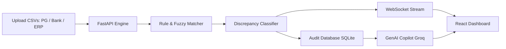

# ⚡ Razorpay AI Reconciliation Engine & Autonomous GenAI Agent

An intelligent, high-speed reconciliation platform designed to automatically ingest, cross-verify, and reconcile transactions across **Payment Gateways (Razorpay)**, **Bank Settlement Statements**, and **Internal ERP/Order Management Systems**. It features an **Autonomous GenAI Financial Copilot** to investigate root causes of mismatches and automate dispute resolution.

---

## 🎯 Problem It Solves

- **Multi-way Mismatches**: Eliminates manual cross-checking between Payment Gateway logs, Bank credit feeds, and Merchant order records.
- **Hidden Fee & MDR Leakages**: Automatically detects excess fee deductions, incorrect GST slabs, and unauthorized gateway charges.
- **Settlement & Payout Delays**: Highlights transactions marked captured by gateway but missing in bank accounts ($T+2$ delays).
- **Manual Investigation Overhead**: Replaces tedious spreadsheets with an autonomous GenAI agent that investigates discrepancies and drafts bank query emails.

---

## 🚀 Core Features

1. **3-Way Deterministic & Fuzzy Matching**
   - Cross-matches Payment Gateway, Bank Settlement, and ERP data.
   - Handles timestamp drifts, reference ID variations, and micro-variances using fuzzy logic.

2. **Automated Discrepancy Classification**
   - **MDR Overcharge**: Detects when gateway fee exceeds contracted rate.
   - **Missing Bank Payout**: Identifies captured transactions never credited by the bank.
   - **Status Desync**: Reconciles mismatched states (e.g. Captured in PG vs Failed/Pending in ERP).
   - **Duplicate Entries**: Flags duplicate debit/credit records.

3. **Autonomous GenAI Financial Copilot**
   - Powered by Groq (Llama 3.3).
   - Answers questions in natural language regarding batch health, high-value discrepancies, and fee leakages.
   - One-click dispute drafting for merchant bank operations.

4. **Real-Time Analytics Dashboard**
   - Live reconciliation progress via WebSockets.
   - Key metrics: Total Volume, Match Rate %, Settlement Variance (₹), Identified Leakage.
   - Visual charts for status distribution and discrepancy trends.
   - CSV upload and full audit report exports.

---

## 🏗️ Architecture & Workflow



---

## 🛠️ Tech Stack

- **Backend**: Python, FastAPI, Pandas, NumPy, TheFuzz, SQLAlchemy, aiosqlite, Uvicorn
- **AI / LLM**: Groq SDK (`llama-3.3-70b-versatile`)
- **Frontend**: React 18, Vite, Tailwind CSS, Recharts, Lucide Icons
- **Real-time**: WebSockets

---

## 📂 Project Structure

```
razorpay-buildathon/
├── razorpay-recon-backend/             # FastAPI Backend
│   ├── main.py                         # API routes & WebSocket server
│   ├── engine.py                       # 3-way matching & fuzzy reconciliation core
│   ├── agent_engine.py                 # GenAI Copilot (Groq integration)
│   ├── catalog.py                      # Discrepancy classification taxonomy
│   ├── models.py                       # Schemas & Database models
│   ├── requirements.txt                # Python dependencies
│   └── .env.example                    # Environment variable sample
│
└── razorpay-recon-frontend/            # React + Vite Frontend
    ├── src/
    │   ├── App.jsx                     # Reconciliation Dashboard & Metrics UI
    │   ├── components/
    │   │   └── AgentChatbot.jsx        # Floating GenAI Copilot Assistant
    │   └── index.css                   # Global styles & Tailwind
    ├── package.json                    # Frontend dependencies
    └── vite.config.js                  # Vite configuration
```

---

## ⚙️ How to Run Locally

### 1. Backend

```bash
cd razorpay-recon-backend

# Create virtual environment
python -m venv venv
.\venv\Scripts\Activate.ps1   # On Windows (or source venv/bin/activate on Mac/Linux)

# Install dependencies
pip install -r requirements.txt

# Set up environment variables
cp .env.example .env
# Edit .env and put your GROQ_API_KEY

# Start server
uvicorn main:app --reload --port 8000
```
- API runs at: `http://localhost:8000`
- Swagger Docs: `http://localhost:8000/docs`

---

### 2. Frontend

```bash
cd razorpay-recon-frontend

# Install dependencies
npm install

# Start development server
npm run dev
```
- Web UI runs at: `http://localhost:5173`

---

## 🔌 API Endpoints

- `POST /upload` - Upload multi-source CSV files (PG, Bank, ERP)
- `POST /process/{batch_id}` - Trigger reconciliation processing
- `GET /results/{batch_id}` - Fetch reconciliation metrics, matches, and discrepancies
- `POST /chat` - Query the GenAI Financial Copilot
- `GET /catalog/ai-readable` - Fetch discrepancy taxonomy
- `WS /ws` - Live WebSocket feed for progress tracking
